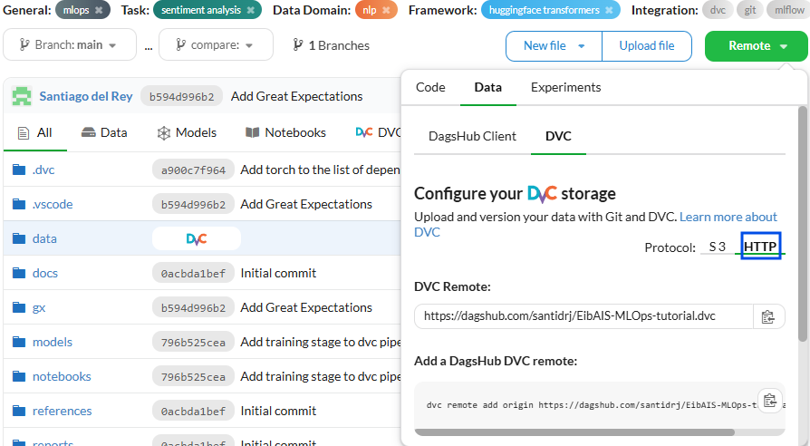

# DVC demo<!-- omit in toc -->
In this demo we will see the main features of [DVC](https://dvc.org/) to version control the data and the models of a 
simple machine learning project.

## Contents <!-- omit in toc -->
- [Install DVC](#install-dvc)
- [Initialize DVC](#initialize-dvc)
- [Configure DVC](#configure-dvc)
- [Working with DVC](#working-with-dvc)
  - [Adding data to DVC](#adding-data-to-dvc)
  - [Import raw data](#import-raw-data)
  - [Create a DVC pipeline](#create-a-dvc-pipeline)
    - [Data preparation stage](#data-preparation-stage)
    - [Data preprocessing stage](#data-preprocessing-stage)
    - [Data split stage](#data-split-stage)
    - [Model training stage](#model-training-stage)
  - [Run the pipeline](#run-the-pipeline)
- [FAQ](#faq)


## Install DVC
First, we need to install DVC. We can do this by running the following command:

```bash
uv add dvc
```
## Initialize DVC
To initialize DVC in our project. We can do this by running the [`dvc init`](https://dvc.org/doc/command-reference/init) command:

```bash
dvc init
```

This will create a `.dvc` directory in our project, and a `.dvcignore` file to specify files that we do not want to track.

## Configure DVC
Next, we will configure DVC to use a remote storage to store the data and the models. We will use Dagshub Storage as a
remote since it has 100GB of free storage and has a good integration with DVC. To do this, we first need to create a
repository in Dagshub or to [link our GitHub repository to Dagshub](https://dagshub.com/docs/integration_guide/github/). Then, we can easily [configure DVC to use Dagshub
Storage](https://dagshub.com/docs/feature_guide/dagshub_storage/#working-with-the-dvc-remote) as its remote by following the instructions in your Dagshub repository.

<p align="center">
    
</p>

If you have correctly configured DVC to use Dagshub Storage as its remote, your `.dvc/config` file should look like [this](../.dvc/config).

## Working with DVC
### Adding data to DVC
To start tracking our data with DVC, we need to add it to DVC. We can do this using the [`dvc add`](https://dvc.org/doc/command-reference/add) command:

```bash
dvc add data/raw/imdb.parquet
```

This will create a `imdb.dvc` file inside `data/raw/`, and a `.gitignore` file (if it has not been already created). The `imdb.dvc` file is a text file that tells DVC where the data is stored, and how to download it. The `.gitignore` file is a text file that tells Git to ignore the data files, and to track only the `imdb.dvc` file.

We can also add a whole directory to DVC by running the following command:

```bash
dvc add data
```

With this, every new file or directory added to the `data` directory will be automatically tracked by DVC. We can also add the subdirectories of `data` individualy to DVC by running the same command for each subdirectory. For example, we can add the `data/raw` subdirectory by running:

```bash
dvc add data/raw
```

### Import raw data
In case you are working with data comming from another project using DVC or Git, you can import the data using the [`dvc import`](https://dvc.org/doc/command-reference/import) command:

```bash
dvc import https://github.com/collab-uniba/Software-Solutions-for-Reproducible-ML-Experiments input/home-data-for-ml-course/train.csv -o data/raw

dvc import https://github.com/collab-uniba/Software-Solutions-for-Reproducible-ML-Experiments input/home-data-for-ml-course/test.csv -o data/raw
```

Observe that, although available in Kaggle, we import the data from another public GitHub repository,
[Software Solution For Reproducible ML Experiments](https://github.com/collab-uniba/Software-Solutions-for-Reproducible-ML-Experiments).
This is to demonstrate the capability of DVC to download a file or directory tracked by another DVC or Git repository,
and track it. This means that, if the data changes in the original repository, we can update it in our
project by running [`dvc update`](https://dvc.org/doc/command-reference/update).

Alternatively, we could also use the [`dvc get`](https://dvc.org/doc/command-reference/get) command to download the data.
Unlike `dvc import`, `dvc get` does not track the data, but it is useful to download data from a remote storage without
tracking it. If we wanted to track them after downloading them, we could use [`dvc add`](https://dvc.org/doc/command-reference/add)
to add them to the DVC repository. However, we would not get the benefits of tracking the data in the original repository.

```bash
dvc get https://github.com/collab-uniba/Software-Solutions-for-Reproducible-ML-Experiments input/home-data-for-ml-course/train.csv -o data/raw

dvc get https://github.com/collab-uniba/Software-Solutions-for-Reproducible-ML-Experiments input/home-data-for-ml-course/test.csv -o data/raw
```

### Create a DVC pipeline
Now, we will create a DVC pipeline to get the data, process it, and train the model. This pipeline will consist of three stages:
`download`, `preprocess`, `split`, and `train`. The `download` stage will fetch the raw data from Hugging Face. The `prepare` stage will clean the data, and the `split` stage will split it into training, validation, and test sets. The `train` stage will train an LLM using the training set and evaluate it on the validation set.
To create a stage we use the [`dvc stage add`](https://dvc.org/doc/command-reference/stage/add) command.

#### Data preparation stage
```bash
dvc stage add -n download \
-d src/data/download_raw_dataset.py \
-o data/raw/imdb.parquet \
python -m src.data.download_raw_dataset
```

The options used in the command are the following:
* `-n`: name of the stage
* `-d`: dependencies of the stage. Any stage can depend on data files, code files, or other stages. Notice that the
source code itself is marked as a dependency as well. If any of these files change, DVC will know that this stage needs to be reproduced when the pipeline is executed.
* `-o`: specify a file or directory that is the result of running the command.
* The last line, `python -m src.data.download_raw_dataset` is the command to run in this stage

> **Note:** DVC uses the pipeline definition to automatically track the data used and produced by any stage, so there's no need to manually run `dvc add` for data/prepared!

#### Data preprocessing stage
```bash
dvc stage add -n preprocess \
-d src/data/download_raw_dataset.py -d data/raw/imdb.parquet \
-o data/interim/imdb_cleaned.parquet \
python -m src.data.preprocess
```

#### Data split stage
```bash
dvc stage add -n split \
-d src/data/split_data.py -d data/interim/imdb_cleaned.parquet \
-o data/processed/train.parquet -o data/processed/validation.parquet -o data/processed/test.parquet \
python -m src.data.split_data
```

#### Model training stage
```bash
dvc stage add -n train \
-d src/modeling/train.py -d data/processed/train.parquet -d data/processed/valiation.parquet \
-o models/distilbert-imdb -o models/distilbert-imdb-checkpoint \
python -m src.models.train
```

### Run the pipeline
The details about each stage are automatically stored by DVC in the [`dvc.yaml`](../dvc.yaml) file. We can run the pipeline by executing
the following command:

```bash
dvc repro
```

You'll notice a [`dvc.lock`](../dvc.lock) (a "state file") was created to capture the reproduction's results. It is a
good practice to commit this file to Git after its creation or modification, to record the current state and results.

## FAQ
- If you are already tracking a file or directory with Git, you cannot add it to DVC. You need to remove it from Git first by running `git rm --cached <file or directory>`, and then add it to DVC.
- You cannot track a directory with DVC if it contains any file or directory already tracked by DVC. You need to remove the tracked files or directories first by running `dvc remove <file or directory>`, and then add the directory to DVC.
